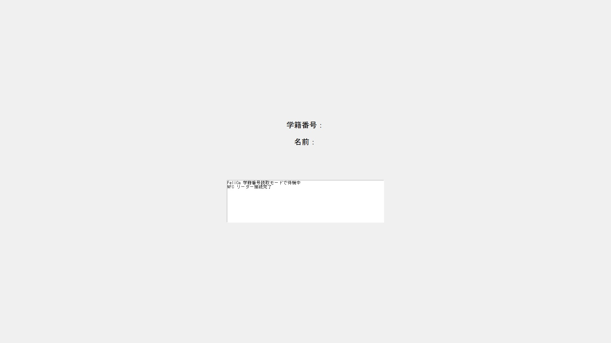

# カードリーダーのビルド・実行方法
FeliCa カードリーダーを使った学生入退室管理システムです。<br>
カードをかざすと入退室を記録し、Slack への通知・週次集計送信を行います。<br>
プログラムの説明は[こちら](./program/)から

## ダウンロード方法
1. ターミナルを起動する
2. 適切なディレクトリに移動する
    ```
    cd ~/ディレクトリ名
    ```
3. リポジトリをクローンする
    ```
    git clone https://github.com/Ikeneko/card_reader
    ```
    このコマンドにより、リポジトリをローカルマシンにクローンし、新しいディレクトリが作成されます。

## 必要なもの
- Windows PC
- Python 3.11（※ 3.12 以降は nfcpy 非対応）
- FeliCa リーダー（Sony RC-S380 等）
- Slack Bot Token・チャンネル ID

## セットアップ
### 1. Python 3.11 をインストールする
https://www.python.org/downloads/release/python-3119/

から「Windows installer (64-bit)」をダウンロードして実行します。

> **注意：** インストール時に「Add Python to PATH」は **チェックしない**（既存の Python と競合しないようにするため）

---

### 2. .env ファイルを作成する
`.env.example` をコピーして `.env` を作成し、値を入力します。

```
SLACK_BOT_TOKEN=xoxb-実際のトークン
SLACK_CHANNEL=C0実際のチャンネルID
WEEKLY_POST_URL=http://IPアドレス:ポート番号/card_entry
```

> `WEEKLY_POST_URL` は、指定のIPアドレスに１週間分の滞在時間データを送信するための項目です。<br>
> 必要なければ、 `card_reader.py` と `.env` の該当箇所を削除してください。<br>
> プログラムは[こちら](./program/card_reader.py)から

---

### 3. FeliCa リーダーのドライバを WinUSB に切り替える
nfcpy は WinUSB ドライバを必要とします。<br>
[Zadig](https://zadig.akeo.ie/) を使って以下の手順で切り替えてください。

1. Zadig を起動する
2. `Options` → `List All Devices` にチェックを入れる
3. ドロップダウンから `RC-S380/S` を選択する
4. ドライバを `WinUSB` に選択して `Replace Driver` をクリックする

> Sony 純正アプリが不要になる場合があります。<br>
> デバイスマネージャーの「ドライバーの更新」→「自動検索」で元に戻せます。

---

### 4. 仮想環境を作成してライブラリをインストールする
`card_reader.py` が格納されているフォルダに移行して以下を実行します。

```bat
C:\Users\<ユーザー名>\AppData\Local\Programs\Python\Python311\python.exe -m venv venv311
venv311\Scripts\activate
pip install -r requirements.txt
```

---

### 5. ビルドする
`build.bat` ファイルを実行します。<br>
実行出来なければ、仮想環境を有効化した状態でコマンドプロンプトから実行してください。

```bat
venv311\Scripts\activate
pyinstaller card_reader.spec --noconfirm
```

完了すると以下のフォルダが生成されます。

```
dist\
└── card_reader\
    ├── card_reader.exe
    ├── Entry用.wav     ← 別途用意してください（任意）
    ├── Exit用.wav      ← 別途用意してください（任意）
    └── _internal\
        ├── .env
        └── ...
```

> **注意：** `.exe` 単体では動きません。`dist\card_reader\` フォルダごと移動・配布してください。

## 実行
1. FeliCa リーダー（Sony RC-S380 等）をPCに接続
2. ビルドができているか確認する
    - `.env` にSlackトークン、チャンネルID、送信先IPアドレスが記載されているか
    - `dist\card_reader\` に音声ファイル(.wav)が格納されているか（任意）
    - 音声ファイル(.wav)を格納する場合は、`dist\card_reader\_internal\.env` の `ENTRY_SOUND` / `EXIT_SOUND` にファイルパスが記載されているか
3. `dist\card_reader\` 内にある `card_reader.exe` を実行
4. 以下の画面が表示されているか確認
    
    - 表示されていなければ、よくあるエラーを参考にしてください。

## 実行時に自動生成されるファイル
| ファイル名 | 内容 |
|---|---|
| `student_map.json` | 学籍番号 → 氏名の対応表 |
| `entry_log.json` | 入退室の全履歴 |
| `weekly_sent.json` | 週次集計の送信済み記録 |
| `weekly_last_run.txt` | 最後に集計を実行した日時 |

これらは `.gitignore` に含まれており、Git で管理されません。<br>
実行時に `dist\card_reader\` 内に自動生成されます。

## よくあるエラー
| エラー | 対処 |
|---|---|
| `Failed to load Python DLL '...\python314.dll'` | Python 3.11 の仮想環境でビルドし直す |
| `ModuleNotFoundError: No module named 'nfc'` | `pip install nfcpy` を実行してから再ビルド |
| `LIBUSB_ERROR_NOT_SUPPORTED [-12]` | Zadig で WinUSB ドライバに切り替える（上記手順参照） |
| 起動してもすぐ閉じる | `card_reader.spec` の `console=False` を `console=True` に変えて再ビルドするとエラーログが表示される |
| Slack 通知が届かない | `dist\card_reader\_internal\.env` の内容を確認する |
| ウイルス対策ソフトが反応する | PyInstaller 製の exe は誤検知されることがある。除外設定に追加する |
